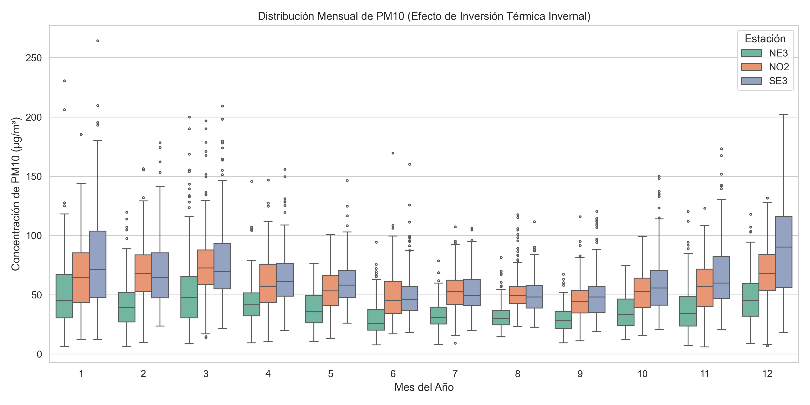
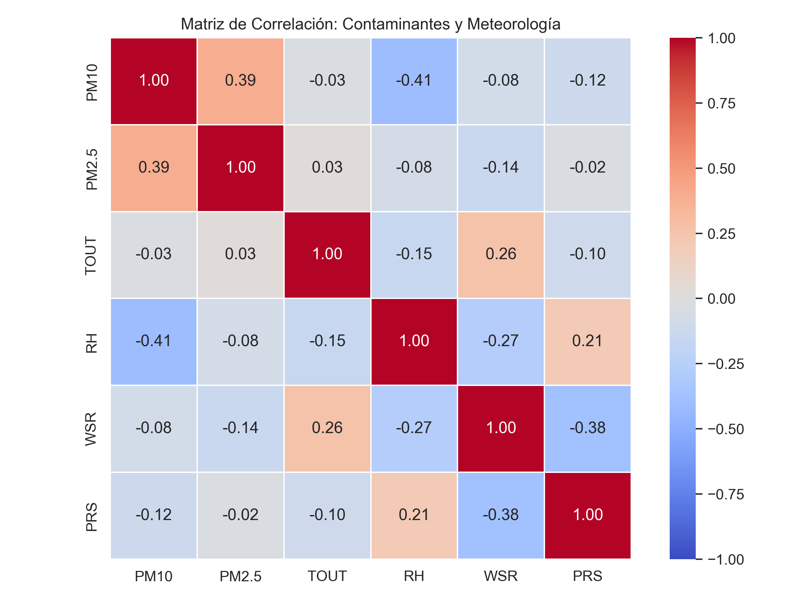
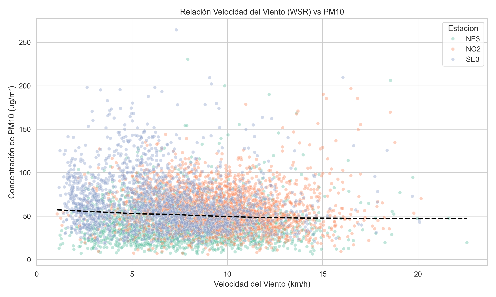

# Objetivo del Análisis y Evolución del Alcance

## Pregunta de Investigación

¿De qué manera influyen las condiciones meteorológicas y los gases precursores en la variabilidad de las concentraciones diarias de material particulado ($PM_{10}$) en la Zona Metropolitana de Monterrey, y cómo puede optimizarse la selección de estaciones de monitoreo mediante distancia multivariada para construir modelos autorregresivos capaces de predecir contingencias ambientales en el corto plazo?

## Objetivo General

Desarrollar y validar un marco de modelado predictivo multivariado para pronosticar concentraciones diarias de $PM_{10}$ \cite{ramirez2025modeling} en tres estaciones pivote representativas de la Zona Metropolitana de Monterrey (SE3, NO2, NE3). Se utiliza la distancia de Mahalanobis para la selección de estaciones y el modelo estacional SARIMAX con variables exógenas para proveer al Sistema de Monitoreo Ambiental (SIMA) una herramienta funcional de alerta temprana.

## Cambios y Justificación del Alcance

El diseño del proyecto se ajustó para reflejar la dinámica real de los datos del SIMA. Inicialmente, la información horaria presentaba huecos por fallas de sensores y volatilidad extrema por ráfagas de corta duración que distorsionaban la tendencia general de la calidad del aire. Para estabilizar la señal, se transicionó a promedios diarios. En apego a la norma NOM-025-SSA1 \cite{ssa2021nom025}, solo se validaron días con al menos 18 horas de registro ($\ge 75\%$ de disponibilidad). Las ventanas faltantes menores a tres horas se imputaron mediante interpolación lineal por estación, garantizando la continuidad sin mezclar comportamientos entre estaciones. 

El cambio estructural más significativo fue el reemplazo del agrupamiento por $k$-means en favor de la Distancia de Mahalanobis. Los métodos de clustering tradicionales promedian el comportamiento de las estaciones, por lo cual los modelos tenian dificultades en encontrar los clusters ya que cada estación se comporta de manera significativamente difeente. La Distancia de Mahalanobis resolvió esto al evaluar la matriz de covarianza de los datos, consiguiendo el triplete de estaciones que exhibe los comportamientos más extremos y contrastantes, sin forzar promedios artificiales. Finalmente, el horizonte predictivo se ajustó de un año a una ventana de corto plazo. La meteorología pierde predictibilidad después de dos semanas; proyectar a 365 días acumula mucho error y se vuelve inútil para la gestión de contingencias \cite{gonzalez2011temporal}.

# Técnicas Estadísticas y Flujo Metodológico

## Agregación Normativa y Filtros

Se depuró la base de datos eliminando anomalías registradas por los sensores (temperaturas de -57 °C y vientos sobre 158 km/h), acotando los valores a límites realistas (-5 °C a 45 °C y máximo 80 km/h). Las correcciones se aplicaron mediante arrastre del último valor válido (forward fill) por estación @tbl-coherencia.

## Selección por Distancia de Mahalanobis

Para aislar las estaciones más distantes, la distancia entre dos estaciones $i$ y $j$ se definió como:

$$D_M(\mathbf{u}_i, \mathbf{u}_j) = \sqrt{(\mathbf{u}_i - \mathbf{u}_j)^T S_{\text{pooled}}^{-1} (\mathbf{u}_i - \mathbf{u}_j)}$$

Donde $\mathbf{u}_i$ es el vector de medias de las variables en la estación $i$, y $S_{\text{pooled}}^{-1}$ es la pseudo-inversa de la matriz de covarianza agrupada. Se seleccionó el trío que maximiza la separación espacial @tbl-mahalanobis:

$$\text{Maximizar } \mathcal{D} = D_M(\mathbf{u}_1, \mathbf{u}_2) + D_M(\mathbf{u}_1, \mathbf{u}_3) + D_M(\mathbf{u}_2, \mathbf{u}_3)$$

# Resultados del Análisis Exploratorio

El procesamiento confirmó la heterogeneidad geográfica de la metrópoli. La selección de Mahalanobis arrojó una separación combinada de 19.97, aislando a SE3 (Cadereyta), NO2 (García) y NE3 (Pesqueria).

El análisis visual confirma los mecanismos físicos de estas tres zonas:

- Efecto de Inversión Térmica: La @fig-estacionalidad demuestra un patrón en forma de "U". Durante los meses de invierno (noviembre a marzo), el enfriamiento del suelo impide la mezcla vertical del aire, disparando la concentración de $PM_{10}$ con picos frecuentes por encima de los 150 $\mu g/m^3$. En contraste, la inestabilidad atmosférica del verano facilita la ventilación, comprimiendo la dispersión de los datos.

- Agentes de Lavado Atmosférico: La @fig-correlacion corrige la percepción sobre la temperatura. La correlación del $PM_{10}$ con la temperatura absoluta ($TOUT$) es nula (-0.03). El verdadero mecanismo de limpieza es la Humedad Relativa ($RH$, $r = -0.41$), cuyo efecto probablemente aglomera las partículas forzando su caída por gravedad.

- Dualidad del Viento: La @fig-efectoviento ilustra cómo el viento funciona como vector de limpieza a velocidades moderadas (reduciendo la concentración base), pero desencadena eventos de resuspensión. Las ráfagas extremas elevan las concentraciones anómalas, particularmente visibles en la dispersión superior de la estación NO2. 

---

# Modelado Predictivo y Técnicas Multivariadas

## Análisis Factorial
Para resolver los problemas de multicolinealidad entre los distintos contaminantes y las variables meteorológicas, se aplicó un Análisis Factorial. Esta técnica de interdependencia redujo la dimensionalidad del conjunto original extrayendo tres variables latentes principales: `Factor_Combustion`, `Factor_Photochemical` y `Factor_Moisture`. La creación de estos factores ortogonales permitió capturar la varianza combinada del sistema atmosférico en índices simplificados, garantizando el cumplimiento de los supuestos de no multicolinealidad requeridos para los modelos de regresión posteriores.

### 1. Filtrado de Adecuación Muestral (Criterio KMO Iterativo)

Antes de la extracción, se evaluó la idoneidad de la matriz de correlaciones mediante el índice de **Kaiser-Meyer-Olkin (KMO)**. Para garantizar la estabilidad del modelo:

* Se implementó una función iterativa que evalúa el KMO global y los coeficientes individuales por variable.
* En cada iteración, si existían variables con $KMO < 0.60$, el algoritmo eliminó **únicamente la variable con la puntuación más baja**, recalculando la matriz de correlación residual para evitar la eliminación prematura de interacciones complejas.
* Se removieron variables exógenas con alta unicidad o baja contribución estructural (`PRS`, `TOUT`, `SR`), logrando una matriz final con un KMO global superior al umbral crítico.

---

### 2. Extracción y Rotación Factorial

* **Método de Extracción:** Se utilizó la **Extracción por Ejes Principales (*Principal Axis / PA*)**, la cual estima de forma iterativa las comunalidades en la diagonal de la matriz de correlación sin asumir estricta normalidad multivariada.
* **Criterio de Selección:** A través del gráfico de sedimentación (*Scree Plot*) y los autovalores de la matriz ($\lambda > 1$), se determinó la retención de **3 factores latentes principales**.
* **Rotación Ortogonal:** Se aplicó una rotación **Quartimax**, cuyo objetivo matemático es simplificar las filas de la matriz de cargas factoriales ($L$), concentrando la varianza en unas cuantas variables por factor y manteniendo la ortogonalidad (independencia lineal) entre los factores extraídos.

---

### 3. Estimación de Puntuaciones Factoriales (*Factor Scores*)

El uso de **Análisis Factorial Exploratorio (AFE)** como paso previo al modelo SARIMAX responde a tres retos fundamentales en la modelación de series de tiempo ambientales:

---

**1. Eliminación Radical de la Multicolinealidad** 
* **El Problema:** En estaciones de monitoreo ambiental, los contaminantes ($\text{CO}, \text{NO}_2, \text{SO}_2$) y las variables meteorológicas ($\text{RH}, \text{O}_3, \text{WSR}$) presentan una **correlación cruzada severa**. Introducir todas estas series simultáneamente como covariables exógenas ($X_t$) en un SARIMAX desestabiliza la estimación por Máxima Verosimilitud, inflando los errores estándar de los coeficientes.
* **La Solución por AFE:** La rotación ortogonal (*Quartimax*) garantiza que los tres factores resultantes (`Combustion`, `Photochemical`, `Moisture`) sean **matemáticamente independientes entre sí ($r = 0$)**. Esto permite aislar el impacto de cada proceso atmosférico sobre la variable objetivo ($\text{PM}_{10}$) sin interferencia estadística.

---

**2. Condensación de Información y Parsimonia del Modelo** 
* **El Problema:** Ajustar un modelo SARIMAX con 8 o 9 variables exógenas individuales (más sus rezagos $t-1$) incrementa exponencialmente el número de parámetros a estimar, provocando sobreajuste (*overfitting*) y pérdida de grados de libertad.
* **La Solución por AFE:** Se reduce la dimensión del problema de 9 variables originales a solo **3 variables latentes sintéticas**, reteniendo más del 65–70% de la varianza explicada del sistema. Un modelo más parsimonioso mejora la capacidad de generalización fuera de muestra (*out-of-sample*).

---

**3. Captura de Mecanismos Físico-Atmosféricos Subyacentes**
En lugar de tratar las variables como mediciones aisladas, las puntuaciones factoriales (*Factor Scores*) representan **fenómenos estructurales del aire**:

* **`Factor_Combustion`:** Actúa como un proxy integrado de la actividad antropogénica (industria + tráfico vehicular).
* **`Factor_Photochemical`:** Sintetiza la dinámica de formación de contaminantes secundarios accionados por radiación solar y viento.
* **`Factor_Moisture`:** Modela el efecto de la humedad ambiental sobre la deposición o suspensión de partículas.

---

### Impacto Directo en la Evaluación SARIMAX

La incorporación de estos factores (junto con sus rezagos $t-1$) explica directamente el rendimiento
Para transferir la información al modelo predictivo SARIMAX, las puntuaciones factoriales continuas se calcularon mediante el **método de regresión**:

$$W = R^{-1} L$$

$$\mathbf{F} = \mathbf{Z} \cdot W$$

Donde:
* $\mathbf{Z}$: Matriz de datos originales estandarizados ($Z = \frac{X - \mu}{\sigma}$).
* $R^{-1}$: Pseudoinversa de Moore-Penrose de la matriz de correlación de los predictores.
* $L$: Matriz de cargas factoriales rotadas.
* $W$: Matriz de pesos factoriales (*factor score weights*).
* $\mathbf{F}$: Puntuaciones factoriales resultantes (`Factor_Combustion`, `Factor_Photochemical`, `Factor_Moisture`).

---

### Interpretación Físico-Atmosférica de los Factores Extraídos

La estructura de cargas factoriales resultante permitió agrupar las variables originales en tres dimensiones físicas bien definidas @tbl-resultsFac

## Modelo SARIMAX y Validación de Errores
Se implementaron modelos de series de tiempo SARIMAX utilizando los factores extraídos como variables exógenas para predecir el comportamiento del $PM_{10}$ @tbl-factors.

* El modelo para la estación NO2 es el más eficiente y apto para predicción operativa, presentando un error porcentual absoluto medio (MAPE) del 15.43% y los errores absolutos más bajos de la red.
* Las estaciones SE3 y NO2 requirieron un nivel de diferenciación ($d=1$) para estabilizar su media temporal, mientras que NE3 se modeló como un proceso puramente autorregresivo.
* Todos los modelos capturaron exitosamente un ciclo estacional de 7 días, reflejando la dinámica de la actividad vehicular e industrial de la zona metropolitana a lo largo de la semana.

## Importancia de Variables Exógenas
Los factores extraídos (`Factor_Combustion`, `Factor_Photochemical`, `Factor_Moisture`) demostraron ser predictores estadísticamente significativos (valor $p < 0.05$, tendiendo a $0.000$) en las tres estaciones. En la estación SE3 (Cadereyta), los coeficientes de regresión muestran que la humedad y la combustión tienen el impacto más fuerte sobre la varianza del $PM_{10}$. En contraste, para la estación NE3 (Pesquería), el factor de combustión domina de forma aislada como la variable explicativa de mayor peso.

## Validación de Supuestos Matemáticos
* **Estacionariedad:** Validada implícitamente mediante la diferenciación de primer orden en las ecuaciones de NO2 y SE3, logrando que la media de la serie fuera constante en el tiempo.
* **Normalidad de Residuos:** La prueba de Jarque-Bera arrojó valores de curtosis superiores a 10 para SE3 y NO2. Esto indica que los residuos no se distribuyen de forma normal (son fuertemente leptocúrticos), ya que el modelo lineal subestima los picos anómalos o extremos de contaminación.
* **Homocedasticidad:** La prueba de Ljung-Box sugiere la presencia de heterocedasticidad temporal; la varianza de los errores cambia, incrementándose drásticamente durante los episodios de muy alta concentración.

# Conclusiones Parciales y Siguientes Pasos

El uso combinado del Análisis Factorial y la Distancia de Mahalanobis permitió aislar eficientemente las dinámicas subyacentes de calidad del aire y seleccionar las tres estaciones con comportamientos más contrastantes (NO2, SE3, NE3), eliminando la redundancia espacial en la red de monitoreo. La implementación de modelos SARIMAX validó que la meteorología, los factores de combustión y la periodicidad semanal son excelentes predictores base de la contaminación (alcanzando un destacable error del 15.43% en la estación NO2). 

Sin embargo, el análisis de residuos indica que las ecuaciones lineales subestiman los episodios extremos de $PM_{10}$, evidenciado por la alta curtosis y la heterocedasticidad de los errores. Para la siguiente fase, el objetivo primario evolucionará para enfocarse en la optimización del modelado de estos eventos extremos. El camino a seguir consistirá en explorar transformaciones logarítmicas en la variable dependiente, o evaluar la integración de algoritmos no lineales (como XGBoost o redes neuronales) en un formato de ensamble para corregir los picos residuales y mejorar el MAPE en las estaciones SE3 y NE3.

## Enlace al Repositorio de Código:

\href{https://github.com/INFOAOAA/SIMA_Proyecto/tree/main/Documento}{Enlace al Repositorio de Código del Documento} 

# Declaratoria de uso de IA:

Opción B. Se utilizó IA especificando:

- Herramienta: Gemini.

- Uso realizado: Evaluación del borrador contra los requisitos de la rúbrica, estructuración del documento al formato QMD (Markdown), y apoyo en la síntesis y redacción de los resultados técnicos (Análisis Factorial, métricas de error de SARIMAX).

- Secciones donde se utilizó: "Modelado Predictivo y Técnicas Multivariadas", "Conclusiones Parciales y Siguientes Pasos", y la configuración general del preámbulo QMD.

- Validación realizada por los estudiantes: Verificamos que todas las interpretaciones estadísticas y métricas correspondieran a las salidas generadas por nuestro código.

- Confirmación: Confirmamos que se revisó, verificó y que se asume la responsabilidad del contenido final entregado.

\onecolumn

# Anexos {#sec-anexos}

### Tabla A.1: Estadísticos Descriptivos de las Variables Continuas (2020–2025)

| Variable | Descripción | Unidad | Media | Mediana | Desv. Est. | IQR | Mín | Máx |
| :--- | :--- | :--- | :--- | :--- | :--- | :--- | :--- | :--- |
| **$PM_{10}$** | Partículas en suspensión $<10\,\mu m$ | $\mu\text{g/m}^3$ | 62.45 | 54.10 | 38.20 | 42.15 | 2.10 | 380.00 |
| **$PM_{2.5}$** | Partículas finas $<2.5\,\mu m$ | $\mu\text{g/m}^3$ | 24.18 | 21.00 | 14.30 | 16.50 | 0.50 | 195.00 |
| **$O_3$** | Ozono | $\text{ppb}$ | 28.35 | 25.20 | 18.10 | 22.40 | 0.00 | 145.00 |
| **$NO_2$** | Dióxido de nitrógeno | $\text{ppb}$ | 15.80 | 13.90 | 9.40 | 11.20 | 0.00 | 85.00 |
| **$SO_2$** | Dióxido de azufre | $\text{ppb}$ | 7.62 | 4.80 | 8.15 | 6.90 | 0.00 | 92.00 |
| **$TOUT$** | Temperatura ambiente | $^\circ\text{C}$ | 22.40 | 23.10 | 6.85 | 9.50 | -2.50 | 43.80 |
| **$RH$** | Humedad relativa | $\%$ | 58.20 | 60.10 | 19.40 | 28.30 | 8.00 | 99.00 |
| **$WSR$** | Velocidad del viento | $\text{km/h}$ | 8.45 | 7.20 | 4.60 | 5.80 | 0.10 | 42.00 |

## Información de la Calidad y Estructura de los Datos {#sec-datos-info}

En esta sección se detallan las características del conjunto de datos utilizado, incluyendo los registros, valores nulos y continuidad temporal.

**Información General:**
- **Total de registros:** 31,449
- **Total de columnas:** 18
- **Estaciones únicas:** 15
- **Memoria (MB):** 4.4

### Verificación de Continuidad Temporal

| Estación | Fecha Inicio | Fecha Fin | Días Esperados | Días Registrados | Días Faltantes | Continuo |
|---|---|---|---|---|---|---|
| CE | 2020-01-01 | 2025-12-31 | 2192 | 2192 | 0 | True |
| NE | 2020-01-01 | 2025-12-31 | 2192 | 2192 | 0 | True |
| NE2 | 2020-01-01 | 2025-12-31 | 2192 | 2192 | 0 | True |
| NE3 | 2021-01-01 | 2025-12-31 | 1826 | 1826 | 0 | True |
| NO | 2020-01-01 | 2025-12-31 | 2192 | 2192 | 0 | True |
| NO2 | 2020-01-01 | 2025-12-31 | 2192 | 2192 | 0 | True |
| NO3 | 2022-12-01 | 2025-12-31 | 1127 | 1127 | 0 | True |
| NTE | 2020-01-01 | 2025-12-31 | 2192 | 2192 | 0 | True |
| NTE2 | 2020-01-01 | 2025-12-31 | 2192 | 2192 | 0 | True |
| SE | 2020-01-01 | 2025-12-31 | 2192 | 2192 | 0 | True |
| SE2 | 2020-01-01 | 2025-12-31 | 2192 | 2192 | 0 | True |
| SE3 | 2020-01-01 | 2025-12-31 | 2192 | 2192 | 0 | True |
| SO | 2020-01-01 | 2025-12-31 | 2192 | 2192 | 0 | True |
| SO2 | 2020-01-01 | 2025-12-31 | 2192 | 2192 | 0 | True |
| SUR | 2020-01-01 | 2025-12-31 | 2192 | 2192 | 0 | True |

: Verificación de continuidad temporal por estación {#tbl-continuidad}

### Estado de Valores Nulos y Tipos de Dato

| Variable | Tipo de Dato | Valores Nulos | Porcentaje Nulos (%) |
|---|---|---|---|
| Fecha | datetime64[us] | 0 | 0.0 |
| Horas_Registradas | float64 | 0 | 0.0 |
| CO, NO, NO2, NOX, O3 | float64 | 0 | 0.0 |
| PM10, PM2.5, PRS, RH | float64 | 0 | 0.0 |
| SO2, SR, TOUT, WDR, WSR, RAINF | float64 | 0 | 0.0 |
| Estacion | str | 0 | 0.0 |

: Estado de valores nulos y tipos de dato de las variables registradas {#tbl-nulos}

### Alertas de Coherencia

| Variable | Mínimo Detectado | Máximo Detectado | Valores Anómalos |
|---|---|---|---|
| TOUT | -57.794348 | 36.783889 | 247 |
| WSR | 0.104348 | 158.858333 | 7 |
| PRS | 681.805556 | 747.666667 | 31449 |

: Alertas de coherencia física en los datos meteorológicos {#tbl-coherencia}

## Selección de Estaciones Representativas {#sec-seleccion}

Basado en el análisis espacial, las 3 estaciones más representativas seleccionadas son **NE3**, **NO2** y **SE3**, con una Separación de Mahalanobis Combinada de **19.9786**.

| | CE | NE | NE2 | NE3 | NO | NO2 | NO3 | NTE | NTE2 | SE | SE2 | SE3 | SO | SO2 | SUR |
|---|---|---|---|---|---|---|---|---|---|---|---|---|---|---|---|
| **CE** | 0.00 | 2.48 | 2.67 | 5.70 | 1.02 | 3.61 | 2.47 | 2.51 | 2.28 | 3.95 | 3.77 | 6.20 | 3.30 | 1.50 | 2.21 |
| **NE** | 2.48 | 0.00 | 2.61 | 3.58 | 2.33 | 5.70 | 3.87 | 3.05 | 2.60 | 1.66 | 2.05 | 4.01 | 5.47 | 1.85 | 3.33 |
| **NE2** | 2.67 | 2.61 | 0.00 | 5.02 | 2.20 | 4.74 | 3.55 | 3.39 | 2.97 | 3.30 | 3.36 | 5.40 | 4.47 | 2.06 | 2.69 |
| **NE3** | 5.70 | 3.58 | 5.02 | 0.00 | 5.37 | 8.74 | 6.99 | 5.34 | 5.65 | 2.39 | 2.70 | 2.01 | 8.55 | 5.07 | 5.96 |
| **NO** | 1.02 | 2.33 | 2.20 | 5.37 | 0.00 | 3.71 | 2.68 | 2.52 | 2.30 | 3.62 | 3.54 | 5.92 | 3.40 | 1.31 | 1.96 |
| **NO2** | 3.61 | 5.70 | 4.74 | 8.74 | 3.71 | 0.00 | 2.91 | 4.54 | 4.48 | 7.04 | 6.87 | 9.23 | 1.12 | 4.11 | 3.41 |
| **NO3** | 2.47 | 3.87 | 3.55 | 6.99 | 2.68 | 2.91 | 0.00 | 2.87 | 2.65 | 5.16 | 5.38 | 7.30 | 3.01 | 2.46 | 2.92 |
| **NTE** | 2.51 | 3.05 | 3.39 | 5.34 | 2.52 | 4.54 | 2.87 | 0.00 | 2.60 | 4.10 | 4.09 | 5.84 | 4.30 | 2.53 | 3.17 |
| **NTE2**| 2.28 | 2.60 | 2.97 | 5.65 | 2.30 | 4.48 | 2.65 | 2.60 | 0.00 | 4.03 | 4.19 | 6.04 | 4.15 | 2.04 | 2.99 |
| **SE** | 3.95 | 1.66 | 3.30 | 2.39 | 3.62 | 7.04 | 5.16 | 4.10 | 4.03 | 0.00 | 1.82 | 2.77 | 6.85 | 3.14 | 4.42 |
| **SE2** | 3.77 | 2.05 | 3.36 | 2.70 | 3.54 | 6.87 | 5.38 | 4.09 | 4.19 | 1.82 | 0.00 | 3.00 | 6.66 | 3.49 | 4.48 |
| **SE3** | 6.20 | 4.01 | 5.40 | 2.01 | 5.92 | 9.23 | 7.30 | 5.84 | 6.04 | 2.77 | 3.00 | 0.00 | 9.06 | 5.58 | 6.63 |
| **SO** | 3.30 | 5.47 | 4.47 | 8.55 | 3.40 | 1.12 | 3.01 | 4.30 | 4.15 | 6.85 | 6.66 | 9.06 | 0.00 | 3.88 | 3.38 |
| **SO2** | 1.50 | 1.85 | 2.06 | 5.07 | 1.31 | 4.11 | 2.46 | 2.53 | 2.04 | 3.14 | 3.49 | 5.58 | 3.88 | 0.00 | 1.94 |
| **SUR** | 2.21 | 3.33 | 2.69 | 5.96 | 1.96 | 3.41 | 2.92 | 3.17 | 2.99 | 4.42 | 4.48 | 6.63 | 3.38 | 1.94 | 0.00 |

: Matriz de Distancia de Mahalanobis por Pares {#tbl-mahalanobis}

## Factores del análisis factoriales

Resultados del análisis

| Factor Latente | Variables Dominantes | Significado Dinámico / Ambiental |
| :--- | :--- | :--- |
| **`Factor_Combustion`** | $\text{CO}, \text{NO}, \text{NO}_2, \text{SO}_2, \text{PM}_{2.5}$ | Emisiones primarias derivadas de tráfico vehicular e industria. |
| **`Factor_Photochemical`** | $\text{O}_3, \text{WSR}, \text{WDR}$ | Reacciones secundarias ligadas a la radiación solar y transporte de viento. |
| **`Factor_Moisture`** | $\text{RH}$ (Humedad Relativa) | Condiciones de dispersión y humedad ambiental. |

: Factores del análisis factoriales {#tbl-resultsFac}

## Figuras y Visualizaciones {#sec-figuras}

Para un análisis visual del comportamiento de los contaminantes y su relación con las variables meteorológicas, se incluyen las siguientes figuras:

{#fig-estacionalidad}

{#fig-correlacion}

{#fig-efectoviento}

### Análisis Factorial {#sec-factors}

| Estación | Modelo SARIMAX | Estacionalidad | MAE ($\mu g/m^3$) | RMSE ($\mu g/m^3$) | MAPE (%) |
| :--- | :--- | :--- | :--- | :--- | :--- |
| **NO2** | (1, 1, 2) | (1, 0, 1, 7) | 7.279 | 8.653 | 15.43 |
| **SE3** | (1, 1, 2) | (1, 0, 1, 7) | 13.373 | 20.123 | 35.38 |
| **NE3** | (1, 0, 0) | (1, 0, 0, 7) | 10.666 | 12.651 | 40.39 |

: factores extraídos como variables exógenas para predecir el comportamiento del $PM_{10}$ {#tbl-factors}