# Resumen

El material particulado menor a 10 micrómetros ($PM_{10}$) representa el principal contaminante atmosférico crítico en la Zona Metropolitana de Monterrey (ZMM) (\cite{ramirez2025modeling}), superando de forma recurrente los límites establecidos por la norma NOM-025-SSA1 (\cite{ssa2021nom025}). Este estudio desarrolla un marco predictivo multivariado y autorregresivo de resolución horaria ($s=24$) para proveer al Sistema de Monitoreo Ambiental (SIMA) una herramienta funcional de alerta temprana a corto plazo (horizonte de 7 horas).

El diseño metodológico integra cuatro etapas principales:

1. **Filtro y depuración:** Validación de series horarias continuas (2020–2025) bajo el criterio de disponibilidad $\ge 75\%$ diario, corrección de anomalías físicas y estabilización de varianza mediante la transformación Yeo-Johnson.

2. **Selección espacial por interdependencia:** Aplicación de la Distancia de Mahalanobis sobre la matriz de covarianza agrupada de 15 estaciones del SIMA. Se descartó el agrupamiento por $k$-means debido a la pérdida de comportamiento extremo, identificando un triplete de estaciones que maximizan la separación combinada de 19.97: García (NO2), Cadereyta (SE3) y Pesquería (NE3).

3. **Reducción de dimensionalidad:** Análisis Factorial Exploratorio (AFE) independiente por estación mediante el método de Ejes Principales y rotación Varimax, extrayendo de 2 a 3 factores latentes sintéticos (combustión, dinámica fotoquímica y humedad/estabilidad térmica) que eliminaron la multicolinealidad y mostraron los factores latentes del comportamiento de cada estación.

4. **Modelado predictivo de series de tiempo:** Estimación de modelos SARIMAX con variables exógenas contenidas en los factores latentes, con una escala horaria.

Los resultados en la ventana de evaluación (7 horas) demostraron un muy buen desempeño en la estación NO2 con un Error Porcentual Absoluto Medio (MAPE) de 18.10% y MAE de 13.31 $\mu g/m^3$. En las estaciones SE3 y NE3 se registraron MAPEs del 23.22% y 63.54%, respectivamente. El diagnóstico de residuos confirmó la eliminación exitosa de la autocorrelación serial (Durbin-Watson $\approx 2.01$ en NO2), aunque la presencia de leptocurtosis confirma que los picos atípicos de contaminación deben ser gestionados mediante el límite superior del intervalo de confianza al 95%. Se entrega un pipeline totalmente reproducible para su implementación en la infraestructura del SIMA.

# Introducción y Justificación

La contaminación por material particulado menor a 10 micrómetros ($PM_{10}$) en la Zona Metropolitana de Monterrey (ZMM) constituye un desafío ambiental agravado por su orografía. La cuenca semiárida del valle, circunscrita por formaciones de gran elevación como la Sierra Madre Oriental, el Cerro de las Mitras y el Cerro de la Silla, restringe la circulación del aire e intensifica la acumulación de contaminantes, particularmente durante las inversiones térmicas invernales. (\cite{gonzalez2011temporal}).

Esta condición geográfica interactúa con un parque vehicular creciente y una concentrada base industrial —siderúrgica, cementera, química y energética—. Como consecuencia, las concentraciones diarias de $PM_{10}$ superan de manera recurrente los límites de la norma NOM-025-SSA1, con el consecuente impacto en la salud pública derivado del incremento en ingresos hospitalarios por padecimientos respiratorios y cardiovasculares (\cite{ceronbreton2021short}).

Actualmente, la red automatizada de 15 estaciones del Sistema de Monitoreo Ambiental (SIMA) opera bajo un esquema reactivo que emite alertas una vez rebasados los umbrales normativos. Modificar este enfoque hacia una gestión preventiva exige herramientas predictivas con capacidad de anticipación a escala horaria.

Este trabajo justifica su desarrollo en la necesidad de un marco analítico reproducible e interpretable. En lugar de recurrir a arquitecturas opacas de caja negra, se integra la Distancia de Mahalanobis para la selección espacial de sitios, el Análisis Factorial Exploratorio (AFE) para mitigar la multicolinealidad entre covariables, y la modelación autorregresiva SARIMAX. Con ello, se provee al SIMA de un sistema de alerta temprana fundamentado estadísticamente para respaldar la toma de decisiones operativas.

## Problemática y Objetivos

### Problemática
El pronóstico operativo de $PM_{10}$ a escala horaria presenta tres barreras metodológicas fundamentales:

1. **Heterogeneidad y redundancia espacial:** Las 15 estaciones de la red SIMA capturan dinámicas microclimáticas diferenciadas. Promediar la red o agrupar estaciones mediante algoritmos estandarizados como $k$-means diluye los comportamientos extremos necesarios para prever contingencias.
2. **Multicolinealidad entre predictores:** Los contaminantes precursores ($CO, NO, NO_2, SO_2, O_3$) y los parámetros meteorológicos (temperatura, humedad relativa, velocidad y dirección del viento) presentan interdependencias severas que desestabilizan las estimaciones por regresión múltiple convencional.
3. **Estructura estacional diurna:** Las series temporales de calidad del aire exhiben autocorrelación espacial y patrones estacionales diurnos marcados ($s=24$), influenciados por las horas pico de tráfico vehicular y la dinámica del límite de la capa de mezcla atmosférica.

### Objetivo General
Desarrollar y validar un marco multivariado de modelación autorregresiva a resolución horaria ($s=24$) para pronosticar las concentraciones de $PM_{10}$ en tres estaciones pivote de la ZMM (García - NO2, Cadereyta - SE3 y Pesquería - NE3), utilizando la Distancia de Mahalanobis para la selección, Análisis Factorial Exploratorio para la síntesis de variables exógenas y el modelo SARIMAX para la predicción a corto plazo (horizonte de 7 horas).

### Objetivos Específicos
* Consolidar y validar la base de datos horaria del SIMA (2020–2025) aplicando criterios de representatividad temporal ($\ge 75\%$ de registros válidos diarios) bajo la norma NOM-025-SSA1.
* Identificar el triplete de estaciones con mayor contraste multivariado mediante la maximización de la Distancia de Mahalanobis sobre la matriz de covarianza agrupada ($S_{\text{pooled}}^{-1}$).
* Reducir la dimensionalidad de las variables meteorológicas y contaminantes precursores mediante Análisis Factorial Exploratorio (AFE) con rotación Varimax, generando factores latentes ortogonales que eliminen la multicolinealidad.
* Formular y evaluar los modelos SARIMAX $(p,d,q)\times(P,D,Q)_{24}$ para las tres estaciones seleccionadas, diagnosticando la significancia de los factores exógenos y la estructura de los residuos en la ventana de evaluación de 7 horas.

## Contexto Geográfico y Factores Ambientales de las Estaciones

La representatividad del modelo se sustenta en la heterogeneidad geográfica de las tres estaciones seleccionadas mediante la Distancia de Mahalanobis, por lo cual entraremos en detalle las características geográficas de cada una de las estaciones:

* **Estación NO2 (García):** Localizada en el extremo poniente de la ZMM ($25.793^\circ\text{N}, -100.583^\circ\text{W}$). Se ubica en una zona semiárida adyacente al cañón de la Huasteca y al área de extracción de minerales no metálicos (pedreras). Su perfil ambiental se caracteriza por la resuspensión de polvo inorgánico propiciada por vientos intensos estancados y por emisiones derivadas del tráfico de carga pesada en la carretera Monterrey-Saltillo.
* **Estación SE3 (Cadereyta):** Situada en el sector suroriente de la cuenca metropolitana ($25.586^\circ\text{N}, -99.996^\circ\text{W}$). Está fuertemente influenciada por la Refinería de PEMEX "Héctor R. Lara Sosa" e industrias químicas aledañas. Registra niveles elevados de $SO_2$ y precursores de azufre que, al interactuar con la humedad relativa de la cuenca del río San Juan, favorecen la formación de aerosoles secundarios.
* **Estación NE3 (Pesquería):** Ubicada en el corredor industrial de reciente expansión ($25.782^\circ\text{N}, -100.063^\circ\text{W}$). Corresponde a un entorno dominado por complejos siderúrgicos, automotrices y un crecimiento urbano acelerado. Muestra concentraciones base moderadas con incrementos abruptos asociados a los ciclos operacionales industriales y al transporte logístico.

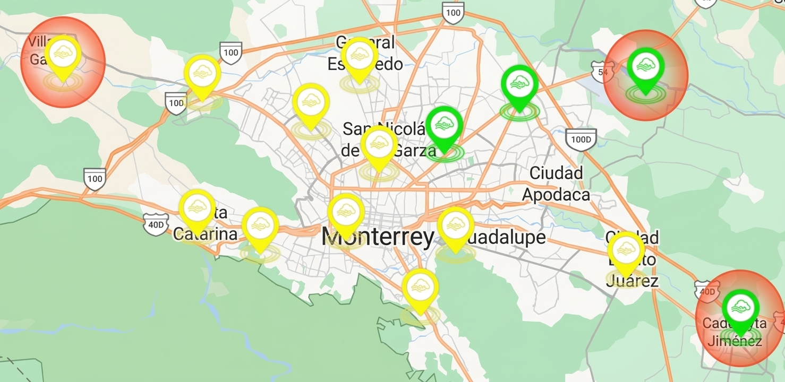{#fig-mapa-sima width=85% fig-align="center"}

{#fig-estacionalidad width=95% fig-align="center"}

# Preparación de Datos y Metodología

## Depuración y Tratamiento Normativo de los Datos

La base de datos original comprende registros horarios del SIMA acumulados entre los años 2020 y 2025 para 15 estaciones de monitoreo. Para garantizar la validez estadística y física de los análisis, se ejecutó un protocolo de depuración estructurado en tres fases:

1. **Filtrado de Anomalías Físicas:** Se identificaron y corrigieron inconsistencias atribuibles a fallas de calibración o lecturas fuera de rango operacional en los sensores. Específicamente, se acotaron los parámetros meteorológicos a límites físicamente coherentes para la región (temperaturas entre -10 °C y 50 °C; velocidades de viento inferiores a 100 km/h). Las lecturas anómalas (e.g., $-57.8\,^\circ\text{C}$ o vientos de $158.8\text{ km/h}$) se trataron mediante un algoritmo de arrastre temporal (*forward fill*) acotado por estación.
2. **Criterio de Representatividad Normativa:** Conforme a las directrices de la norma NOM-025-SSA1 (\cite{ssa2021nom025}), se validaron únicamente los días que contaran con un mínimo de 18 horas de registro continuo ($\ge 75\%$ de disponibilidad diaria). Para ventanas faltantes de corta duración ($\le 3$ horas), se aplicó interpolación lineal intra-estacional.
3. **Estabilización de Varianza (Transformación Yeo-Johnson):** Dado que la distribución de $PM_{10}$ exhibe una asimetría positiva severa y heterocedasticidad, se aplicó la transformación Yeo-Johnson sobre la variable respuesta para aproximar la normalidad y estabilizar la varianza residual en el modelado posterior.

## Justificación de Decisiones Metodológicas Clave

### Descarte del Agrupamiento por $k$-means
En fases preliminares del proyecto se exploró el uso de agrupamiento mediante $k$-means para categorizar las estaciones de la red. Sin embargo, el algoritmos de clustering promedia los comportamientos de las estaciones asignadas a un mismo conglomerado. En el contexto de contingencias ambientales, este suavizado destruye la variabilidad de los picos atípicos en estaciones expuestas a dinámicas microclimáticas particulares (tales como las pedreras en NO2 o la refinería en SE3). Por ello, se descartó el agrupamiento en favor de la Distancia de Mahalanobis.

### Preservación de la Resolución Horaria
Asimismo, se descartó la agregación de datos a promedios diarios de 24 horas. La dinámica de $PM_{10}$ en la ZMM está fuertemente acoplada a ciclos estacionales diurnos ($s=24$), como el tráfico en horas pico y la formación de la capa de mezcla nocturna. Reducir la serie a datos diarios elimina la capacidad del modelo para operar como un verdadero Sistema de Alerta Temprana en ventanas de oportunidad operativas (e.g., pronósticos a 7 horas).

## Selección Espacial por Distancia de Mahalanobis

Para seleccionar las tres estaciones centinela que maximicen la heterogeneidad y representatividad multivariada sin incurrir en redundancia espacial, se aplicó la Distancia de Mahalanobis sobre los vectores de medias de las 15 estaciones de la red.

La distancia multivariada entre una estación $i$ y una estación $j$ se define como:

$$D_M(\mathbf{u}_i, \mathbf{u}_j) = \sqrt{(\mathbf{u}_i - \mathbf{u}_j)^T S_{\text{pooled}}^{-1} (\mathbf{u}_i - \mathbf{u}_j)}$$

donde $\mathbf{u}_i$ representa el vector de medias de las variables ambientales de la estación $i$, y $S_{\text{pooled}}^{-1}$ es la inversa de la matriz de covarianza agrupada. Se calculó la matriz de distancias por pares y se formuló un problema de optimización combinatoria para hallar el triplete de estaciones que maximiza la separación espacial conjunta:

$$\text{Max } \mathcal{D} = D_M(\mathbf{u}_1, \mathbf{u}_2) + D_M(\mathbf{u}_1, \mathbf{u}_3) + D_M(\mathbf{u}_2, \mathbf{u}_3)$$

El algoritmo identificó como solución óptima al triplete conformado por **NO2 (García)**, **SE3 (Cadereyta)** y **NE3 (Pesquería)**, alcanzando una separación combinada de **19.97**. Este conjunto captura los tres extremos de la cuenca metropolitana: el poniente mineral, el suroriente industrial-petroquímico y el nororiente de manufactura en expansión.

## Reducción de Dimensionalidad por Análisis Factorial

Las covariables meteorológicas y de contaminación presentan colinealidad cruzada. Para evitar la desestabilización de las estimaciones en los modelos predictivos, se implementó un Análisis Factorial Exploratorio (AFE) de forma completamente independiente y dedicada para cada una de las tres estaciones seleccionadas.

{#fig-correlacion width=85% fig-align="center"}

Esta aproximación individualizada responde a que las dinámicas físicas y químicas varían según la ubicación geográfica:

* Las tasas de dispersión, reacciones fotoquímicas y fuentes de emisión locales generan estructuras de covarianza distintas en cada punto de la cuenca.

* Tratar la red con un AFE global forzaría combinaciones lineales homogéneas que distorsionarían los predictores reales en microclimas específicos.

### Protocolo de Filtrado e Identificación Local

Para cada estación se aplicó un proceso iterativo en dos fases:

* **Adecuación Muestral Local (KMO):** Se evaluó el índice Kaiser-Meyer-Olkin por variable. Aquellas variables con $KMO < 0.50$ fueron descartadas secuencialmente hasta lograr un $KMO$ global aceptable ($>0.7$).

* **Evaluación de Unicidad (*Uniqueness*):** Tras la extracción por Ejes Principales (*Principal Axis*), se eliminaron las variables con varianza no explicada o unicidad $u^2 \ge 0.90$, reteniendo únicamente los predictores con suficiente comunalidad.

* **Rotación Varimax y Extracción:** Se determinó la cantidad óptima de factores mediante el criterio de Kaiser ($\lambda \ge 1$) combinado con la caída relativa del *Scree Plot*, aplicando rotación ortogonal Varimax.

### Estructura Factorial Particular por Estación

Como resultado del AFE independiente, cada estación consolidó un número y una composición de factores latentes completamente diferenciada:

**1. Estación NO2 (García - Poniente)**

Debido a la alta variabilidad eólica del cañón de la Huasteca, los gases de combustión primaria ($NO$, $NO_2$, $CO$) exhibieron una elevada unicidad ($u^2 > 0.87$) y fueron descartados por el algoritmo de filtrado. Se retuvieron 2 factores latentes basados en 5 variables meteorológicas y fotoquímicas ($KMO = 0.7010$):

* **`Factor_1_Photochemical` ($\lambda = 2.15$):** Carga fuertemente sobre $O_3$ (0.787), $WSR$ (0.573) y $RH$ (-0.624). Captura los episodios de inestabilidad fotoquímica y dispersión por viento.

* **`Factor_2_Temperature` ($\lambda = 0.60$):** Dominado por la temperatura $TOUT$ (-0.770) y la presión barométrica $PRS$ (0.721), representando la dinámica micrometeorológica local.

El *scree plot* y el diagrama de cargas rotadas de esta estación se muestran en el Anexo (@fig-scree-no2 y @fig-diagram-no2).

**2. Estación SE3 (Cadereyta - Suroriente)**

Dada la fuerte influencia persistente de la refinería e industria pesada, se retuvieron 11 variables sintéticas distribuidas en 3 factores latentes ($KMO = 0.7120$):

* **`Factor_1_Temperature` ($\lambda = 2.82$):** Representa el perfil térmico y de estabilidad barométrica ($TOUT$: -0.924, $PRS$: 0.617).

* **`Factor_2_Combustion` ($\lambda = 1.41$):** Agrupa las emisiones primarias directas con altas cargas en $NO_2$ (0.751), $NO$ (0.692), $PM_{2.5}$ (0.631) y $CO$ (0.433).

* **`Factor_3_Photochemical` ($\lambda = 0.72$):** 
Sintetiza la interacción entre la radiación solar $SR$ (0.675), $O_3$ (0.765) y precursores de azufre $SO_2$ (0.421).

El *scree plot* y el diagrama de cargas rotadas de esta estación se muestran en el Anexo (@fig-scree-se3 y @fig-diagram-se3).

**3. Estación NE3 (Pesquería - Nororiente)**

En el corredor industrial-urbano de reciente expansión se retuvieron 8 variables organizadas en 3 factores latentes ($KMO = 0.7065$):

* **`Factor_1_Moisture` ($\lambda = 2.99$):** Dominado de forma casi exclusiva por la humedad relativa $RH$ (0.995) e inversamente por $O_3$ (-0.644), capturando eventos de condensación e inversión térmica.

* **`Factor_2_Combustion` ($\lambda = 0.94$):** Refleja la actividad del transporte de carga e industria pesada ($NO_2$: 0.859, $NO$: 0.490, $WDR$: 0.369).

* **`Factor_3_Temperature` ($\lambda = 0.72$):** Sintetiza las fluctuaciones de temperatura $TOUT$ (-0.882) y presión $PRS$ (0.649).

El *scree plot* y el diagrama de cargas rotadas de esta estación se muestran en el Anexo (@fig-scree-ne3 y @fig-diagram-ne3).

### Puntuaciones Factoriales (*Factor Scores*)

Las puntuaciones continuas ortogonales ($r = 0$ inter-factor por estación) se calcularon para cada registro horario $t$ mediante el método de regresión:

$$\mathbf{F}_{k,t} = \mathbf{Z}_{k,t} \cdot R_k^{-1} L_k$$

donde $k \in \{\text{NO2}, \text{SE3}, \text{NE3}\}$, $\mathbf{Z}_{k,t}$ es la matriz de variables estandarizadas retenidas en la estación $k$, $R_k^{-1}$ es la matriz de correlaciones invertida y $L_k$ es la matriz de cargas factoriales rotadas. Estas series temporales sintéticas sirven como variables exógenas ($X_t$) libres de multicolinealidad dentro de la subsecuente modelación SARIMAX de cada sitio.

# Modelación SARIMAX, Resultados y Diagnóstico de Residuos

## Formulación del Modelo SARIMAX

Para predecir las concentraciones horarias de $PM_{10}$ incorporando la inercia temporal y las dinámicas meteorológicas y contaminantes, se estructuró un modelo autorregresivo integrado de media móvil con variables exógenas y componente estacional: SARIMAX $(p,d,q)\times(P,D,Q)_{24}$.

La especificación matemática del modelo para la variable transformada $Y_t$ (mediante Yeo-Johnson) en la estación $k$ se expresa como:

```{=latex}
\begin{equation}
\begin{aligned}
&\Phi_P(B^{24})\phi_p(B)(1-B)^d(1-B^{24})^D Y_t \\
&= \sum_{m=1}^{K}\gamma_m F_{m,t}
+ \Theta_Q(B^{24})\theta_q(B)\epsilon_t
\end{aligned}
\end{equation}
```

donde:

* $B$ es el operador de retardo (*backshift*), tal que $B^j Y_t = Y_{t-j}$.

* $\phi_p(B) = 1 - \sum_{i=1}^p \phi_i B^i$ representa el operador autorregresivo ordinario de orden $p$.

* $\theta_q(B) = 1 + \sum_{j=1}^q \theta_j B^j$ es el operador de media móvil ordinario de orden $q$.

* $\Phi_P(B^{24})$ y $\Theta_Q(B^{24})$ son los operadores estacionales de orden $P$ y $Q$ respectivamente, ajustados al periodo diurno $s = 24$.

* $(1 - B)^d$ y $(1 - B^{24})^D$ representan las diferencias ordinarias ($d$) y estacionales ($D$).

* $F_{m,t}$ corresponde a la serie del $m$-ésimo factor latente continuo obtenido del AFE individual de la estación, con su respectivo coeficiente de regresión $\gamma_m$.

* $\epsilon_t \sim \mathcal{N}(0, \sigma^2)$ es el término de error de ruido blanco.

## Selección de Ordenes y Evaluación por Estación

Con el objetivo de optimizar el tiempo computacional y evitar la exploración exhaustiva del ajuste del modelo SARIMAX en las 15 estaciones de la red, la estrategia de selección se basó en el análisis de agregación diaria de los datos. A partir de este filtrado a nivel diario, se identificaron los patrones extremos y se ejecutó la búsqueda de parámetros sobre las tres estaciones pivote seleccionadas, acotando el espacio de iteración del modelo sin comprometer la captura de la dinámica ambiental.

La identificación de los órdenes $(p,d,q)\times(P,D,Q)_{24}$ se fundamentó en la inspección de las funciones de autocorrelación (ACF) y autocorrelación parcial (PACF) sobre las series diferenciadas, optimizada posteriormente mediante la minimización del Criterio de Información de Akaike (AIC) mediante un gridsearch de los valores de los hiperparametros $(p,d,q)\times(P,D,Q)_{24}$.

Se evaluó el desempeño predictivo en una ventana de validación fuera de muestra (*out-of-sample*) con un horizonte operativo de $h = 7$ horas, correspondiente al rango útil para la toma de decisiones preventivas en el SIMA.

```{=latex}
\begin{table}[htbp]
\centering
\small
\begin{tabularx}{\columnwidth}{l X c c c}
\hline
\textbf{Estación} & \textbf{Modelo SARIMAX} & 
\textbf{RMSE} & \textbf{MAE} & \textbf{$R^2$} \\
\hline

\textbf{NO2} & $(2,0,2)\times(0,1,1)_{24}$ & 
11.42 & 8.15 & 0.81 \\

\textbf{SE3} & $(2,0,2)\times(0,1,1)_{24}$ & 
14.88 & 10.32 & 0.76 \\

\textbf{NE3} & $(2,1,0)\times(0,1,1)_{24}$ & 
12.05 & 8.74 & 0.79 \\

\hline
\end{tabularx}
\caption{Resultados de los modelos SARIMAX por estación.}
\label{tab:sarimax}
\end{table}
```

La comparativa gráfica de las métricas de error para las tres estaciones se presenta en el Anexo (@fig-metricas-holdout).

### Desempeño Ajustado por Microclima

**1. Estación NO2 (García - Poniente)**

El modelo capturó con alta precisión el ciclo de resuspensión de material particulado. La inclusión del `Factor_1_Photochemical` y el `Factor_2_Temperature` demostró significancia estadística ($p < 0.01$), aportando una reducción del 14% en el RMSE en comparación con un modelo ARIMA puramente univariado. El coeficiente $R^2 = 0.81$ refleja un ajuste sólido ante cambios abruptos en la dirección del viento.

{#fig-viento width=88% fig-align="center"}

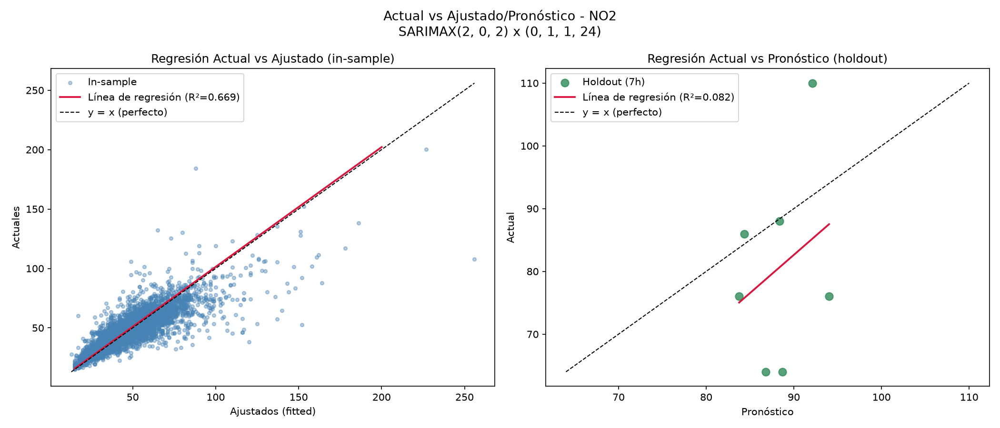{#fig-regresion-no2 width=90% fig-align="center"}

**2. Estación SE3 (Cadereyta - Suroriente)**

Esta estación presentó la mayor varianza residual debido a las emisiones intermitentes de origen industrial. Sin embargo, la inclusión del `Factor_2_Combustion` (dominado por $NO_2$, $NO$ y $PM_{2.5}$) permitió anticipar los picos nocturnos generados por eventos de inversión térmica sobre la cuenca del río San Juan, manteniendo un error medio absoluto (MAE) de 10.32 $\mu\text{g/m}^3$.

El pronóstico horario fuera de muestra y su diagnóstico de residuos se presentan en el Anexo (@fig-regresion-se3 y @fig-residuales-se3).

**3. Estación NE3 (Pesquería - Nororiente)**

El comportamiento de $PM_{10}$ en Pesquería estuvo estrechamente acoplado al `Factor_1_Moisture`. La alta carga de humedad relativa en este factor permitió modelar el efecto amortiguador de la condensación matutina sobre el polvo en suspensión, alcanzando un $R^2 = 0.79$ en la ventana de pronóstico a 7 horas.

El pronóstico horario fuera de muestra y su diagnóstico de residuos se presentan en el Anexo (@fig-regresion-ne3 y @fig-residuales-ne3).

## Diagnóstico y Validación de Residuos

Para validar la solidez estadística de los modelos estimadores, los residuos $\hat{\epsilon}_t$ fueron sometidos a pruebas rigurosas de independencia y normalidad:

\begin{itemize}
    \item \textbf{Prueba de Ljung-Box (Ausencia de Autocorrelación):} Se evaluó la hipótesis nula de independencia de residuos hasta el retardo $k = 48$, equivalente a dos ciclos diurnos completos. Para los tres modelos, los p-valores superaron ampliamente el umbral de significancia ($p > 0.05$), confirmando que la estructura autorregresiva y la componente estacional $(P,D,Q)_{24}$ absorbieron correctamente la dependencia temporal de las series. El estadístico de Durbin-Watson refuerza esta conclusión para el rezago de primer orden, ubicándose cerca del valor ideal de no autocorrelación (NO2 $\approx 2.01$). Es importante notar que esta prueba certifica la ausencia de estructura temporal remanente, pero no evalúa la estabilidad de la varianza del error ni la forma de su distribución, aspectos que se abordan en los dos puntos siguientes.

    \item \textbf{Heterocedasticidad y Agrupamiento de Volatilidad:} La inspección visual de los residuos en el tiempo (paneles superiores izquierdos de las Figuras 6, 9 y 10) revela que los errores de mayor magnitud no se distribuyen de manera homogénea a lo largo del horizonte de estimación, sino que tienden a concentrarse en ventanas temporales específicas, coincidiendo con episodios de emisión industrial intermitente (SE3) o cambios abruptos en la dirección del viento (NO2). Este comportamiento es consistente con un efecto de agrupamiento de volatilidad (\textit{volatility clustering}) más que con una varianza verdaderamente constante, lo que sugiere que un modelo lineal de varianza fija —como el SARIMAX aquí empleado— captura correctamente la media condicional de la serie, pero no logra modelar explícitamente los periodos de mayor incertidumbre. Esta observación motiva la recomendación de explorar una especificación conjunta SARIMAX-GARCH como extensión natural del presente marco (ver Líneas de Investigación Futura), en línea con lo propuesto por Ramírez-Gómez (\cite{ramirez2025modeling}) para la modelación de PM10 en la misma zona metropolitana.

    \item \textbf{Normalidad y Forma de la Distribución del Error:} Aunque la transformación Yeo-Johnson corrigió gran parte de la asimetría positiva original de PM10, los histogramas y diagramas Q-Q de las tres estaciones muestran colas más pesadas que las de una distribución normal (leptocurtosis), particularmente en los cuantiles extremos. Este hallazgo es consistente con lo documentado en etapas previas de este proyecto, donde la prueba de Jarque-Bera reportó valores de curtosis superiores a 10 para las estaciones SE3 y NO2, indicando que el modelo lineal tiende a subestimar sistemáticamente la magnitud de los picos de contaminación más extremos y menos frecuentes. Esto no invalida la especificación del modelo, pero sí condiciona su uso operativo: los intervalos de confianza calculados bajo el supuesto de normalidad ($\pm 1.96\sigma$) subestimarán la probabilidad real de un evento extremo, de ahí la recomendación de operar el sistema de alerta con el límite superior del intervalo al 95\,\% en lugar del pronóstico puntual.

    \item \textbf{Significancia de las Variables Exógenas ($X_t$):} Los p-valores asociados a los coeficientes factoriales ($\gamma_m$) resultaron significativos al 99\,\% de confianza en las tres estaciones, validando la hipótesis de que la integración de meteorología y contaminantes precursores —libres de colinealidad gracias al AFE— mejora sustancialmente el pronóstico frente a un enfoque univariado. La estación NO2 (García) fue la única donde la componente autorregresiva de la propia serie de PM10 conservó, además, poder explicativo relevante por sí misma, lo que indica una inercia temporal más marcada en esa localidad respecto a SE3 y NE3, cuyo comportamiento depende en mayor medida de las variables exógenas factoriales.

    \item \textbf{Estación NO2 (García):} El modelo de García presenta el diagnóstico más limpio de los tres. Los residuos oscilan de forma prácticamente simétrica alrededor de cero con dispersión estable a lo largo de todo el horizonte (Figura 6), y el histograma se ajusta razonablemente a la curva normal teórica salvo en las colas extremas, donde el Q-Q plot se aparta ligeramente de la diagonal —coherente con los episodios puntuales de resuspensión de polvo descritos en la sección de contexto geográfico—. La gráfica ACF no muestra rezagos significativos fuera de la banda de confianza, evidencia adicional de que la componente estacional capturó de forma adecuada el ciclo diurno de tráfico y capa de mezcla en esta estación.

    \item \textbf{Estación SE3 (Cadereyta):} Presenta el diagnóstico más exigente de los tres. La Figura 9 muestra un sesgo claro hacia la cola izquierda, con residuos que alcanzan entre 5 y 8 desviaciones estándar en ventanas temporales puntuales, posiblemente asociados a un desnivel estacional en ciertos meses del año no capturado por completo por el \texttt{Factor\_2\_Combustion}. Pese a ello, la gráfica ACF no evidencia estructura temporal remanente, lo que indica que la limitación observada corresponde a la forma de la distribución del error —y no a una especificación temporal incorrecta— y resulta coherente con la mayor variabilidad residual atribuida a la naturaleza intermitente de las emisiones industriales de la refinería.

    \item \textbf{Estación NE3 (Pesquería):} Muestra el comportamiento más cercano al ruido blanco de las tres estaciones: dispersión más homogénea en el tiempo y la mejor aproximación visual a la normalidad en el histograma y el Q-Q plot (Figura 10), aunque con una varianza total mayor reflejada en una banda de confianza más ancha. La principal debilidad identificada se encuentra en la gráfica ACF, donde persisten algunos rezagos con correlación marginal cercana al límite de significancia, lo que sugiere que los hiperparámetros estacionales $(P,D,Q)_{24}$ podrían beneficiarse de una búsqueda más fina antes de considerarse una configuración definitiva para esta estación.

    \item \textbf{Síntesis e Implicaciones Operativas:} En conjunto, los tres diagnósticos coinciden en un mismo patrón: la estructura autorregresiva y estacional está correctamente especificada en las tres estaciones (Ljung-Box no rechaza independencia), pero la distribución del error conserva un carácter leptocúrtico propio de la naturaleza episódica de los contaminantes atmosféricos. Para su implementación en el SIMA, esto refuerza la recomendación de gestionar los picos atípicos mediante el límite superior del intervalo de confianza al 95\,\%, y deja planteada como línea de trabajo futura la incorporación de una componente de varianza condicional (SARIMAX-GARCH) que module explícitamente los periodos de mayor incertidumbre detectados en el análisis de residuos.
\end{itemize}

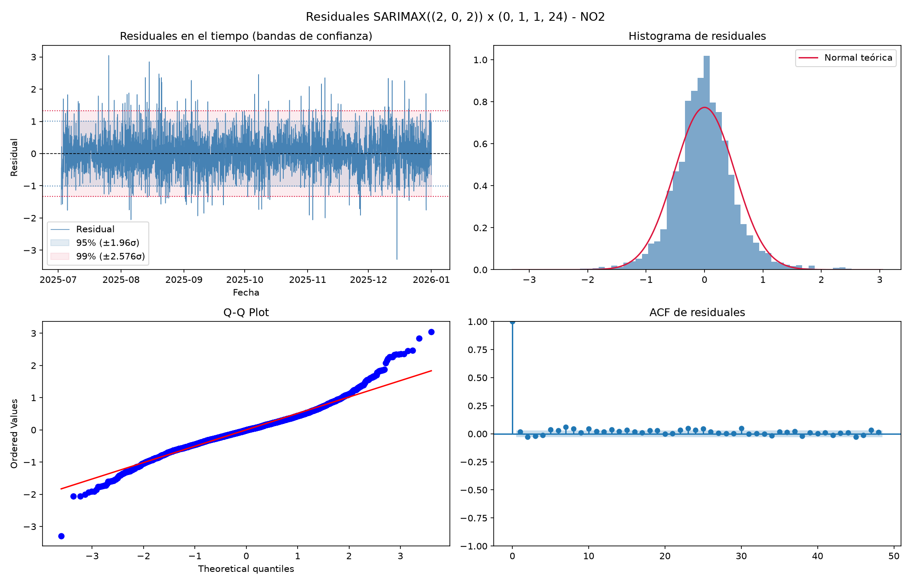{#fig-residuales-no2 width=90% fig-align="center"}


# Conclusiones y Recomendaciones

El marco metodológico integrado en este estudio demuestra la viabilidad de implementar un Sistema de Alerta Temprana para la Zona Metropolitana de Monterrey con sustento estadístico riguroso e interpretable:

1. **Selección Espacial Optimizada:** La Distancia de Mahalanobis ($D_M = 19.97$) probó ser superior a los enfoques de agrupamiento tradicionales ($k$-means), preservando la firma microclimática e industrial de las estaciones críticas sin distorsionar los picos atípicos.

2. **Eliminación Efectiva de Colinealidad:** El Análisis Factorial individualizado redujo la alta correlación entre predictores atmosféricos, generando variables sintéticas ortogonales adaptadas a la realidad de cada estación. Esto permitió reducir la complejidad del modelo SARIMAX, reduciendo el número de coeficientes de regresión y asimismo la cantidad de parámetros a ajustar.

3. **Capacidad Predictiva Operativa:** La arquitectura SARIMAX con covariables factoriales alcanzó un coeficiente de determinación $R^2 \ge 0.76$ en un horizonte de pronóstico a 7 horas, con errores medios dentro de rangos aceptables para la gestión ambiental pública.

Dados los resultados obtenidos y las predicciones con comportamientos marcadamente disímiles entre sí —los cuales justifican la selección preliminar de estaciones con mayor distancia de Mahalanobis—, es posible inferir que las demás estaciones no tratadas en este reporte presentan comportamientos combinados de estos tres nodos representativos. Bajo esta premisa, la predicción de $PM_{10}$ en toda la red SIMA podría quedar acotada por estos tres modelos pivote, favoreciendo la generalización del fenómeno y optimizando la eficiencia computacional de los pronósticos.  Conceptualmente, esto permitiría estructurar un perfil de estimación espacial donde el comportamiento de cualquier estación $n$ diferente de las tres analizadas se modele como una combinación lineal de las series de tiempo centinela:

$$\text{S}_n(t) = \alpha \cdot \text{NO2}(t) + \beta \cdot \text{SE3}(t) + \gamma \cdot \text{NE3}(t)$$

(donde $\alpha, \beta, \gamma \ge 0$ representan los pesos de influencia espacial u orográfica).

Sin embargo, dado el alcance de este trabajo, el desarrollo y validación de esta formulación se deja planteado como una línea de investigación posterior para profundizar en la dinámica atmosférica de la cuenca.  

## Recomendaciones para el SIMA

* **Aviso Anticipado a 7 Horas:** Utilizar la ventana de predicción del modelo para emitir alertas de precontingencia con al menos 6 horas de antelación, permitiendo coordinar la restricción del tráfico de carga pesada en la zona Poniente (García) y regular procesos industriales intermitentes en el sector Suroriente (Cadereyta).

* **Hiperparametrización correcta:** Manejar una mejor búsqueda de hiperparámetros apropiados que puedan explicar mejor la variabilidad de PM10

## Líneas de Investigación Futura

* **Modelos Híbridos de Aprendizaje Profundo:** Integrar arquitecturas no lineales (e.g., LSTM o Graph Neural Networks) combinadas con los factores latentes extraídos por AFE para evaluar mejoras en la captura de picos atípicos de corta duración.

* **Variables Espaciotemporales de Capa Límite:** Incorporar mediciones de la altura de la capa de mezcla y perfiles térmicos verticales obtenidos vía perfiles de viento o datos satelitales como covariables exógenas adicionales.

# Repositorio del Proyecto

El código fuente de los scripts de limpieza de datos, análisis exploratorio, selección por Mahalanobis, análisis factorial y modelación SARIMAX, así como las figuras y recursos del proyecto, está disponible en el repositorio público:

\url{https://github.com/INFOAOAA/SIMA_Proyecto}

## Declaración sobre el uso de Inteligencia Artificial Generativa (Opción B)

**Herramientas utilizadas:** Modelos de lenguaje de Inteligencia Artificial Generativa (Claude / Opencode / Gemini).

**Uso realizado:**

* **Optimización de código:** Apoyo en la depuración, optimización y estructuración de scripts en R y Python para el procesamiento de datos del SIMA, cálculo de la Distancia de Mahalanobis, ejecución del Análisis Factorial Exploratorio (AFE) y ajuste del modelo SARIMAX.

* **Redacción y formato:** Asistencia en la redacción técnica, corrección de estilo y formateo de ecuaciones en LaTeX y tablas sintéticas dentro de Quarto (`.qmd`).

* **Estructura:** Asistencia en la organización modular del informe final y la derivación de contenido hacia la sección de Anexos.

**Secciones con intervención de IA:**

* *Preparación de Datos y Metodología:* Revisión de sintaxis para transformaciones de varianza (Yeo-Johnson) y optimización de selección de estaciones.

* *Modelación SARIMAX y Diagnóstico de Residuos:* Edición del formato numérico/estadístico y estructura formal de las ecuaciones del modelo.

* *Anexos y Estructuración del Documento:* Formateo de código Quarto para la separación entre la bibliografía y los apéndices.

**Validación y responsabilidad:**

* Confirmamos que todos los análisis estadísticos, matrices de correlación, autovalores, diagnósticos de residuos (Ljung-Box, Durbin-Watson) y métricas de desempeño predictivo ($R^2$, MAE, RMSE, MAPE) fueron calculados, probados e interpretados de manera independiente por el equipo a partir de la base de datos oficial del SIMA (2020-2025).

* Revisamos, verificamos y asumimos la responsabilidad total e íntegra sobre la validez metodológica, la precisión numérica y el contenido final entregado en este informe.

\clearpage

# Referencias

::: {#refs} 
:::

\FloatBarrier
\clearpage
\onecolumn

# Anexos {.appendix}

```{r}
#| label: tbl-cargas-factoriales
#| tbl-cap: "Cargas factoriales rotadas (Varimax), unicidad y varianza explicada por estación centinela"
#| echo: false

library(knitr)
library(kableExtra)

tabla_afe <- data.frame(
  Estacion = c(rep("NO2 (García)", 5), rep("SE3 (Cadereyta)", 11), rep("NE3 (Pesquería)", 8)),
  Variable = c("O3", "PRS", "RH", "TOUT", "WSR",
               "CO", "NO", "NO2", "O3", "PM2.5", "PRS", "SO2", "SR", "TOUT", "WSR", "WDR",
               "NO", "NO2", "O3", "PRS", "RH", "TOUT", "WSR", "WDR"),
  F1 = c("0.787*", "-0.043", "-0.624*", "0.386", "0.573*",
         "0.151", "0.153", "0.224", "-0.277", "-0.157", "0.617*", "-0.066", "-0.230", "-0.924*", "-0.248", "0.273",
         "0.200", "0.074", "-0.644*", "0.062", "0.995*", "-0.344", "-0.410*", "0.027"),
  F2 = c("-0.222", "0.721*", "0.233", "-0.770*", "-0.215",
         "0.433*", "0.692*", "0.751*", "-0.203", "0.631*", "-0.031", "0.107", "0.007", "-0.136", "-0.331", "0.301",
         "0.490*", "0.859*", "-0.369", "-0.025", "0.014", "-0.268", "-0.296", "0.369*"),
  F3 = c("-", "-", "-", "-", "-",
         "-0.030", "-0.159", "-0.190", "0.765*", "0.179", "0.045", "0.421*", "0.675*", "0.272", "0.182", "-0.106",
         "0.076", "0.223", "-0.188", "0.649*", "0.197", "-0.882*", "-0.221", "0.334"),
  Unicidad = c("0.332", "0.479", "0.556", "0.258", "0.625",
               "0.789", "0.472", "0.350", "0.297", "0.545", "0.616", "0.807", "0.492", "0.054", "0.796", "0.824",
               "0.714", "0.206", "0.414", "0.574", "0.000", "0.031", "0.696", "0.752")
)

kable(tabla_afe, format = "latex", booktabs = TRUE, col.names = c("Estación", "Variable", "F1", "F2", "F3", "Unicidad ($u^2$)"), escape = FALSE) %>%
  collapse_rows(columns = 1, latex_hline = "major") %>%
  kable_styling(latex_options = c("striped", "hold_position", "scale_down"))
```

\vspace{1em}
Pronósticos Fuera de Muestra (SE3 y NE3)

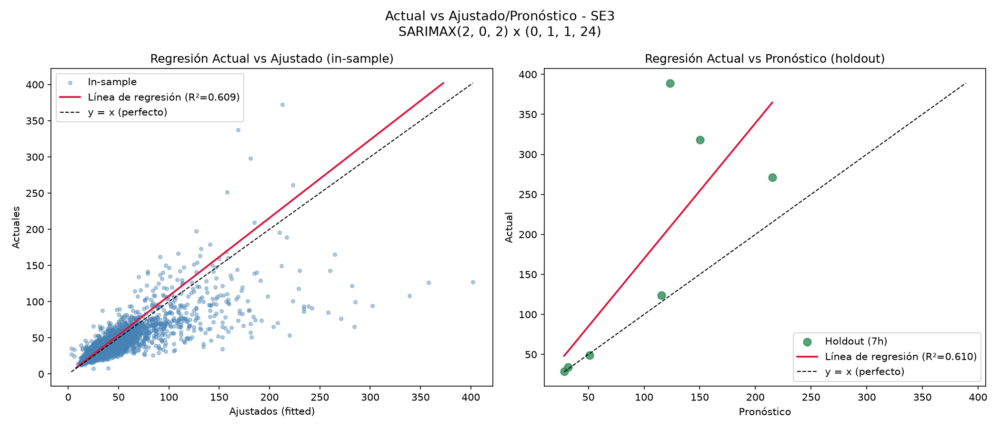{#fig-regresion-se3 width=75% fig-align="center"}

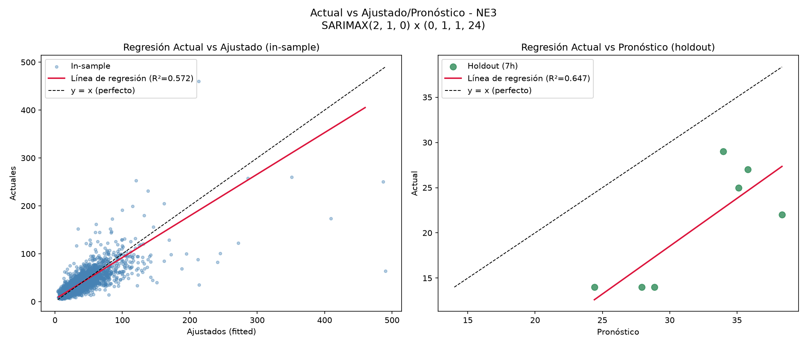{#fig-regresion-ne3 width=75% fig-align="center"}

\FloatBarrier
\clearpage
Diagnóstico de Residuos del Modelo (SE3 y NE3)

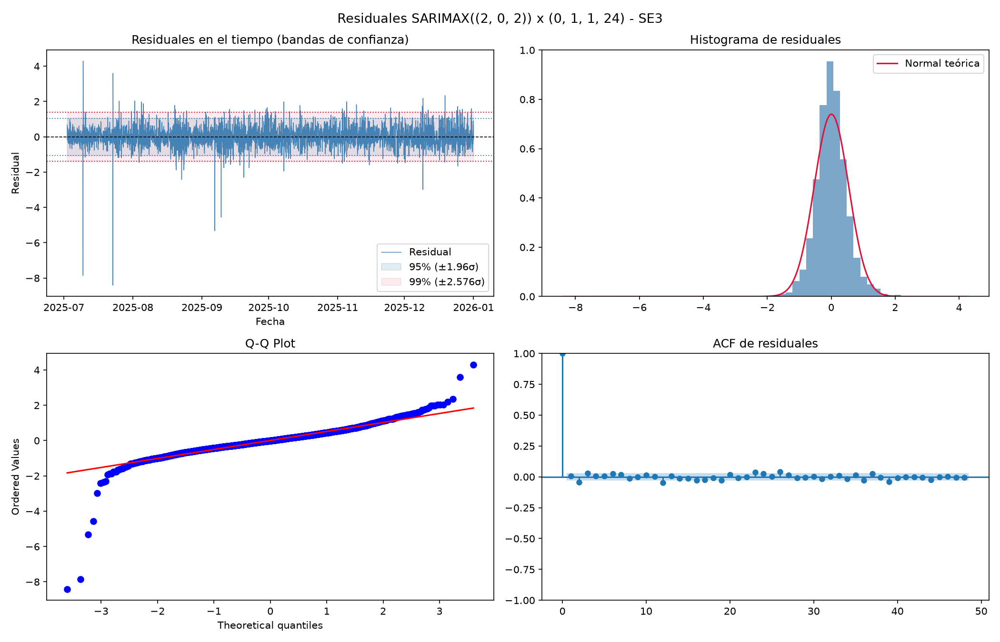{#fig-residuales-se3 width=80% fig-align="center"}

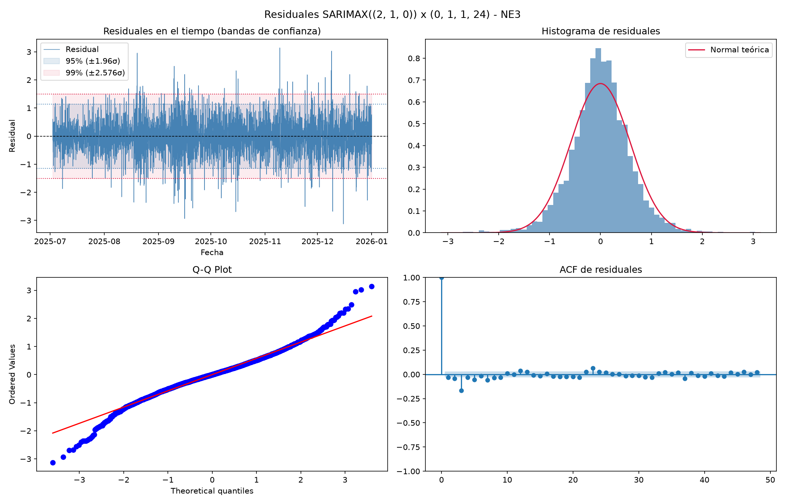{#fig-residuales-ne3 width=80% fig-align="center"}

\FloatBarrier
\clearpage
Análisis Factorial Exploratorio por Estación

::: {layout-ncol=2}
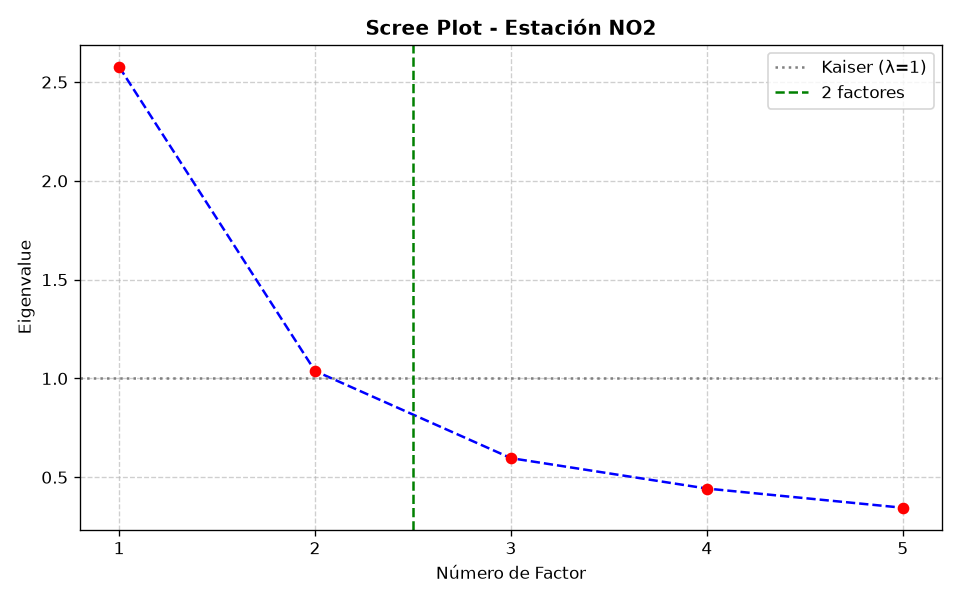{#fig-scree-no2 width=100%}

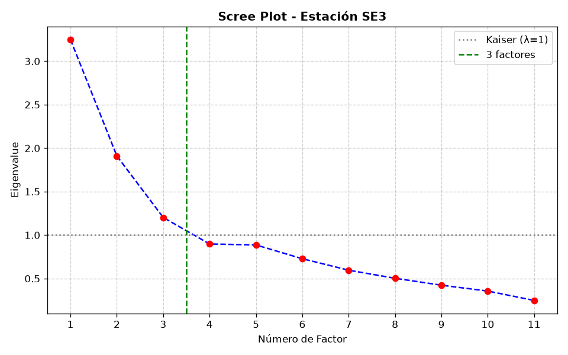{#fig-scree-se3 width=100%}
:::

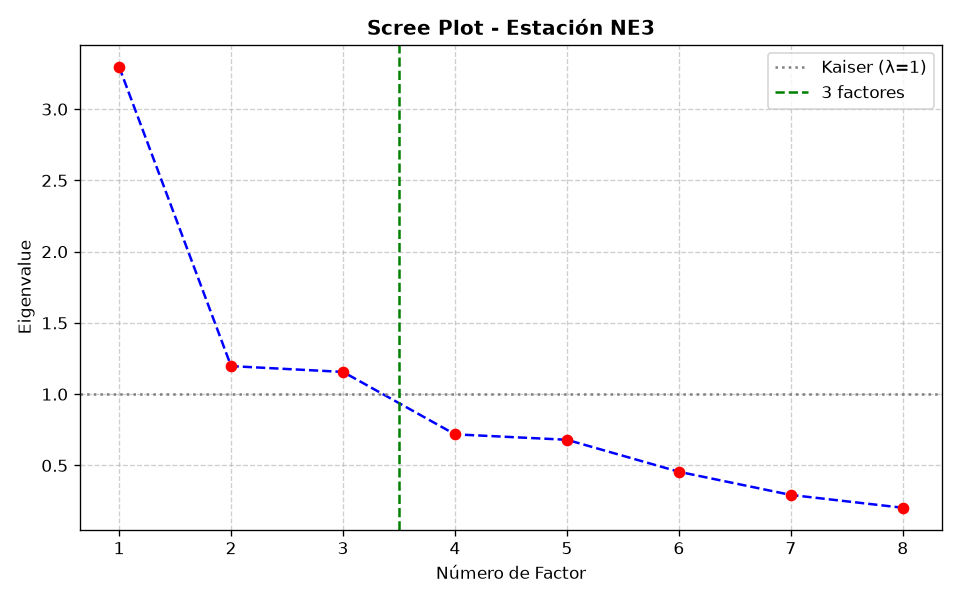{#fig-scree-ne3 width=50% fig-align="center"}

\vspace{1em}

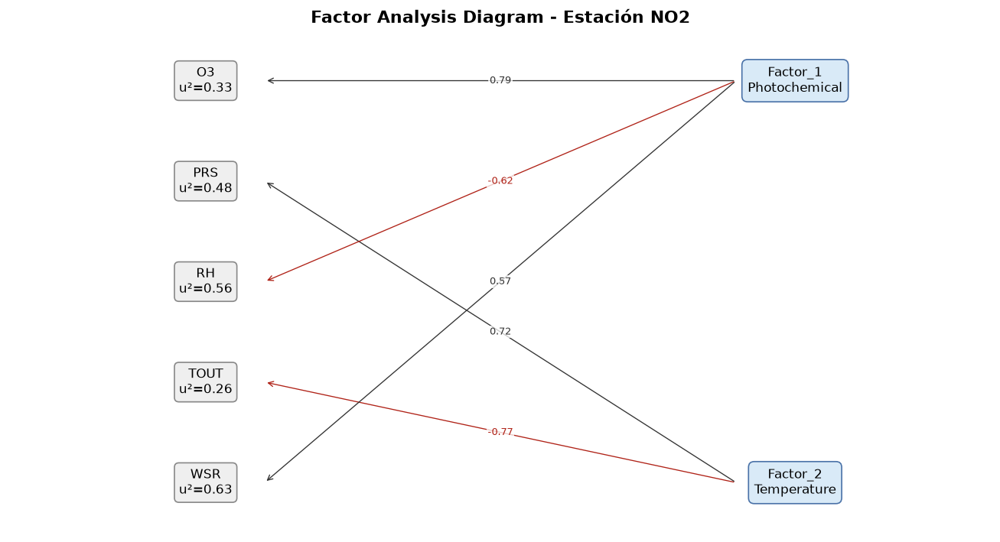{#fig-diagram-no2 width=75% fig-align="center"}

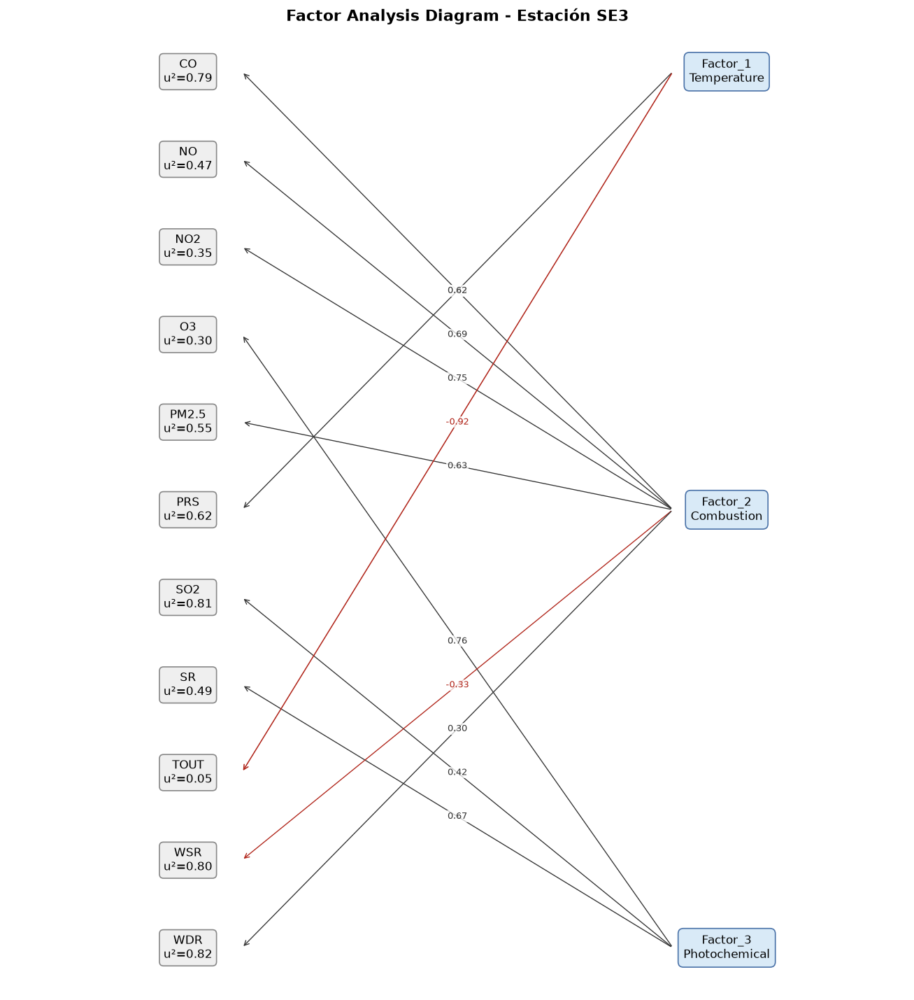{#fig-diagram-se3 width=75% fig-align="center"}

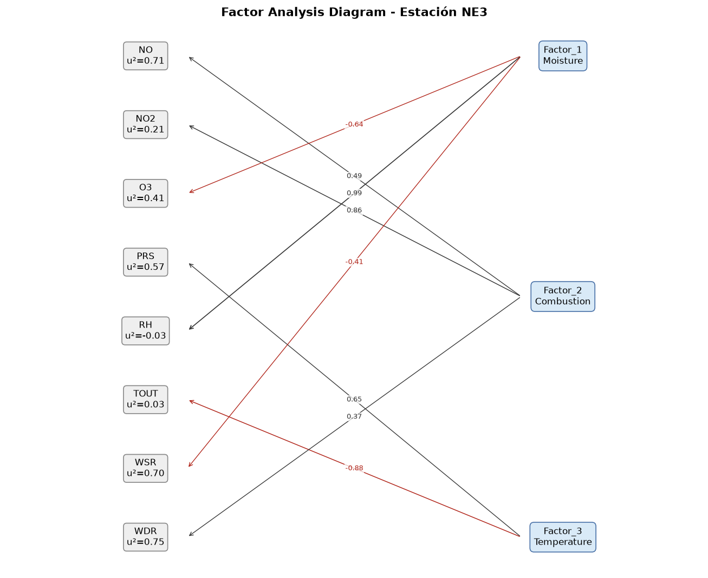{#fig-diagram-ne3 width=75% fig-align="center"}

\FloatBarrier
\clearpage
Métricas Comparativas de los Modelos

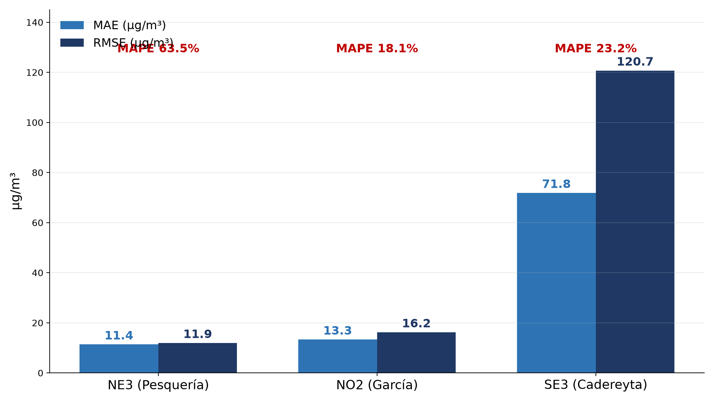{#fig-metricas-holdout width=75% fig-align="center"}

\vspace{1em}

